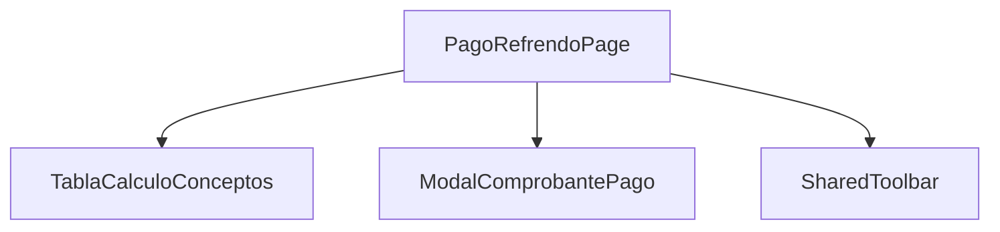

# Componentes Principales del Sistema

## TablaCalculoConceptosComponent
**Ruta:** `src/app/shared/components/tabla-calculo-conceptos/`

### Responsabilidad
Muestra y gestiona el cálculo de conceptos para pagos y trámites

### Propiedades Principales
- `@Input() conceptos: Concepto[]` - Lista de conceptos a mostrar
- `@Output() calcularTotal = new EventEmitter<number>()` - Emite el total calculado

### Métodos Clave
- `calcularImporte()` - Calcula el importe total
- `validarConceptos()` - Valida los conceptos seleccionados

### Dependencias
- Servicio: `SmytService`
- Interfaces: `Concepto`, `RequestConceptos`

---

## PagoRefrendoServicioPublicoComponent
**Ruta:** `src/app/portal-hacienda/pages/smyt/pago-refrendo-servicio-publico/`

### Responsabilidad
Gestiona el proceso de pago de refrendo vehicular para servicio público

### Flujo Principal
1. Captura datos del vehículo
2. Valida información con WS
3. Calcula importes
4. Genera comprobante

### Servicios Relacionados
- `SmytService` - Validación y cálculo
- `GeneralesService` - Datos complementarios

---

## PagoRefrendoPageComponent
**Ruta:** `src/app/portal-hacienda/pages/smyt/pago-refrendo-page/`

### Responsabilidad
Contenedor principal para el proceso de pago de refrendo

### Estructura

### Interacciones
- Coordina el flujo entre componentes hijos
- Gestra eventos de navegación
- Controla estados globales
