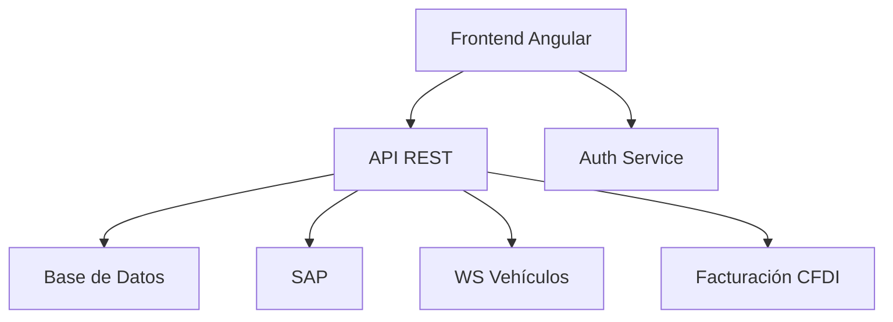
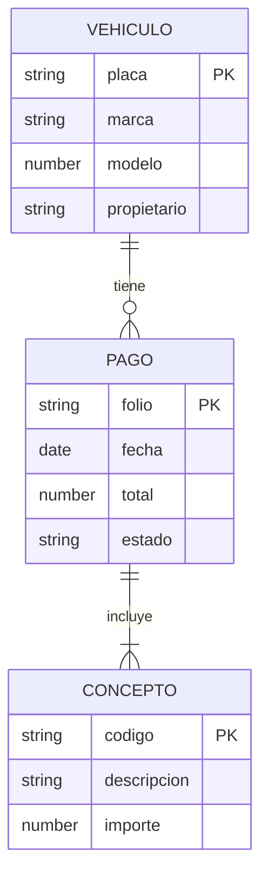

# Documentación de Diseño Técnico

## Diagrama de Arquitectura

## Patrones de Diseño Implementados

### Frontend
- **Componentes Reutilizables**: Tablas, modales, formularios
- **State Management**: Servicios RxJS para estado compartido
- **Lazy Loading**: Carga bajo demanda de módulos

### Backend
- **CQRS**: Separación consultas/comandos
- **Repository**: Acceso a datos
- **Strategy**: Para diferentes métodos de pago

## Modelo de Datos

## Tecnologías Clave

| Área          | Tecnologías                     |
|---------------|---------------------------------|
| Frontend      | Angular 15, Material UI, RxJS   |
| Backend       | Node.js, Express, TypeORM       |
| Base de Datos | SQL Server                      |
| Integraciones | SOAP, REST, SAP RFC             |
| DevOps        | Docker, Jenkins, Nginx          |
