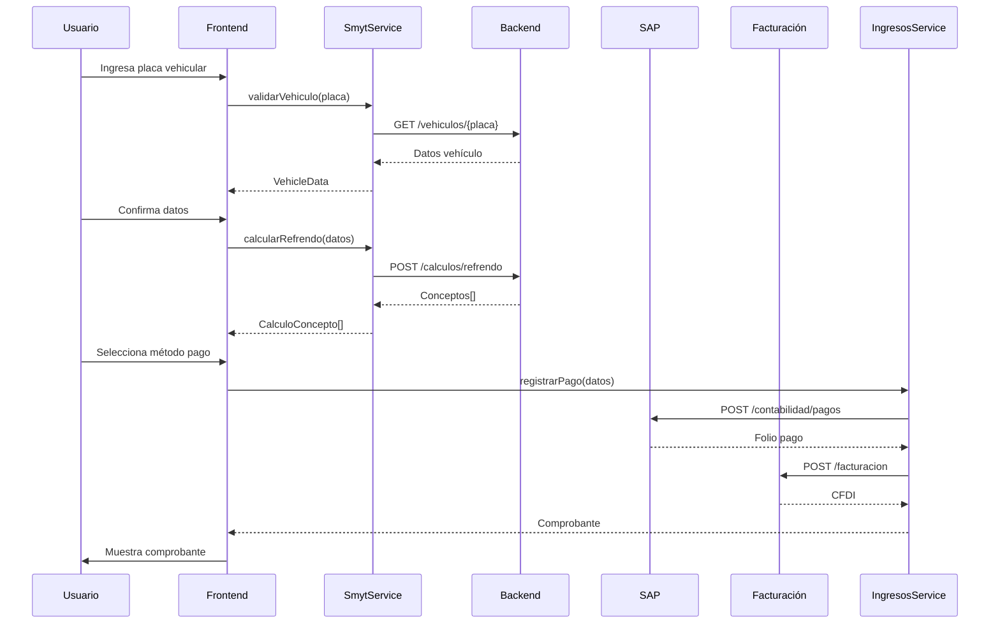

# Flujos de Trabajo Principales

## Pago de Refrendo Vehicular

## Validación de Vehículo

1. Usuario ingresa placa
2. Sistema valida formato (XXX-0000)
3. Consulta WS de vehículos
4. Verifica estado (vigente/baja/robado)
5. Calcula adeudos pendientes
6. Devuelve datos al frontend

## Proceso de Pago

1. Generación de folio único (UUID)
2. Registro contable en SAP
3. Emisión de CFDI
4. Confirmación bancaria (si aplica)
5. Generación de PDF con:
   - Datos vehículo
   - Conceptos pagados
   - Código QR para validación
   - Sello digital

## Integraciones Externas

| Sistema           | Endpoint                          | Autenticación |
|-------------------|-----------------------------------|---------------|
| SAP Contabilidad  | https://sap.morelos.gob.mx/api    | OAuth2        |
| Facturación CFDI  | https://api.facturacion.morelos   | JWT           |
| Validación Vehículos | https://ws.vehiculos.morelos    | WS-Security   |
