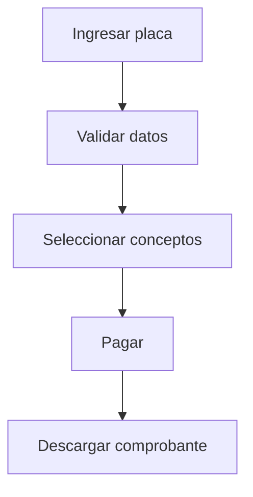

# Manuales de Usuario y Administración

## Instalación para Desarrollo

### Requisitos Previos
- Node.js v16+
- Angular CLI
- Docker (opcional)

### Pasos de Instalación
```bash
# Clonar repositorio
git clone http://192.168.105.116:3000/Ingresos/cobroWeb.git
cd cobroWeb

# Instalar dependencias
npm install

# Configurar variables de entorno
cp .env.example .env

# Iniciar aplicación
ng serve
```

## Configuración Inicial

1. Acceder a `http://localhost:4200/admin`
2. Ingresar credenciales iniciales (admin/admin123)
3. Configurar parámetros básicos:
   - URL de APIs
   - Datos de conexión a BD
   - Correos de notificación

## Guía Rápida de Uso

### Pago de Refrendo


### Administración de Catálogos
1. Navegar a "Administración > Catálogos"
2. Seleccionar tipo de catálogo
3. Usar botón "+" para agregar nuevos
4. Guardar cambios

## Solución de Problemas Comunes

| Problema | Solución |
|----------|----------|
| Error 401 al iniciar sesión | Verificar token JWT en localStorage |
| No se muestran conceptos | Revisar conexión con backend |
| PDF no se genera | Verificar servicio de facturación |

## FAQ

**¿Cómo restablecer contraseña?**
1. Ir a página de login
2. Click en "Olvidé mi contraseña"
3. Seguir instrucciones por correo

**¿Dónde ver el historial de pagos?**
1. Ingresar con credenciales
2. Navegar a "Consultas > Histórico"

## Capturas de Pantalla


