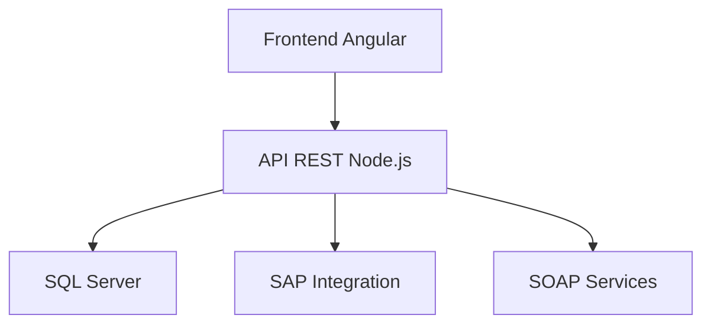

# Prompt Detallado para Asistencia con Sistema de Cobro Web

## Contexto del Sistema
Sistema de cobro en línea para el Gobierno de Morelos que gestiona:
- Pagos de refrendo vehicular (SMYT)
- Trámites de Hacienda
- Facturación electrónica
- Integración con sistemas contables (SAP)

## Estructura Técnica


## Instrucciones Detalladas para AI

### 1. Desarrollo y Mantenimiento
- **Modificación de Componentes**:
  - Usar estructura Angular estándar (components/services)
  - Seguir convenciones de nombres (PascalCase para componentes)
  - Mantener separación de preocupaciones

- **Integración Backend**:
  - Todos los calls API deben usar HttpClient
  - Manejar errores con interceptors
  - Cachear respuestas cuando sea apropiado

### 2. Procesos Clave a Implementar
1. Validación Vehicular:
   - Formato placa: XXX-0000
   - Consulta WS Vehículos
   - Cálculo de adeudos

2. Flujo de Pago:
   - Generación folio único
   - Registro contable
   - Emisión CFDI
   - Generación PDF

### 3. Patrones a Seguir
- Frontend:
  - State Management con RxJS
  - Componentes reutilizables
  - Lazy loading de módulos

- Backend:
  - Repository pattern
  - CQRS para consultas
  - Strategy pattern para métodos de pago

### 4. Requisitos No Negociables
- Seguridad:
  - JWT para autenticación
  - Encriptación datos sensibles
  - Validación inputs

- Rendimiento:
  - Tiempo respuesta < 2s
  - Soporte 100 usuarios concurrentes

### 5. Guía para Documentación
- Mantener actualizados:
  - Diagramas de secuencia
  - Modelo de datos
  - Especificación APIs
  - Manuales de usuario

### 6. Ejemplos de Implementación
```typescript
// Ejemplo servicio Angular
@Injectable({providedIn: 'root'})
export class PaymentService {
  constructor(private http: HttpClient) {}

  processPayment(payment: IPayment): Observable<IPaymentResponse> {
    return this.http.post<IPaymentResponse>(`${API_URL}/payments`, payment);
  }
}
```

## Consideraciones Especiales
1. Cumplir normatividad fiscal
2. Mantener compatibilidad con navegadores oficiales
3. Garantizar accesibilidad (WCAG AA)
4. Implementar logs detallados para auditoría

## Estructura de Archivos Esperada
```
src/
├── app/
│   ├── portal-hacienda/    # Módulo principal
│   ├── shared/             # Componentes comunes
│   └── core/               # Servicios base
├── assets/                 # Imágenes/fuentes
└── environments/           # Configs por ambiente
```

## Flujo de Trabajo Recomendado
1. Analizar issue/ticket
2. Revisar documentación existente
3. Implementar cambios
4. Actualizar documentación afectada
5. Ejecutar pruebas unitarias/integración
6. Solicitar revisión
