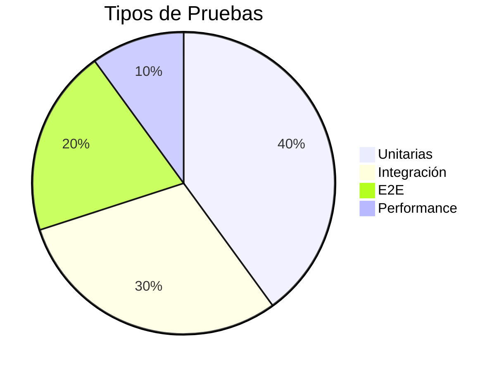

# Plan de Pruebas

## Estrategia de Testing



## Pruebas Unitarias

### Componentes Angular
```typescript
describe('PagoRefrendoComponent', () => {
  let component: PagoRefrendoComponent;
  let fixture: ComponentFixture<PagoRefrendoComponent>;

  beforeEach(async () => {
    await TestBed.configureTestingModule({
      imports: [ReactiveFormsModule],
      providers: [SmytService]
    }).compileComponents();
  });

  it('debe crear formulario válido', () => {
    expect(component.form.valid).toBeTruthy();
  });
});
```

### Servicios
```typescript
it('debe calcular refrendo correctamente', () => {
  const testData: RefrendoRequest = { /*...*/ };
  const expected: CalculoConcepto[] = [/*...*/];
  
  service.calcularRefrendo(testData).subscribe(result => {
    expect(result).toEqual(expected);
  });
});
```

## Pruebas de Integración

```typescript
describe('Pago Integration', () => {
  it('debe completar flujo de pago', () => {
    // 1. Mock servicios
    // 2. Navegar a página pago
    // 3. Llenar formulario
    // 4. Verificar resultado
  });
});
```

## Pruebas E2E con Cypress

```javascript
describe('Pago Refrendo', () => {
  it('completa pago exitoso', () => {
    cy.visit('/pago-refrendo');
    cy.get('#placa').type('ABC-1234');
    cy.get('#btn-validar').click();
    // ... más pasos
    cy.contains('Pago completado').should('be.visible');
  });
});
```

## Reporte de Bugs

| ID | Descripción | Severidad | Estado |
|----|-------------|-----------|--------|
| B001 | Error cálculo recargos | Alto | Resuelto |
| B002 | Formato PDF incorrecto | Medio | Pendiente |

## CI/CD Pipeline

```yaml
steps:
  - run: npm install
  - run: npm test
  - run: npm run e2e
  - deploy:
      when: branch = 'main'
